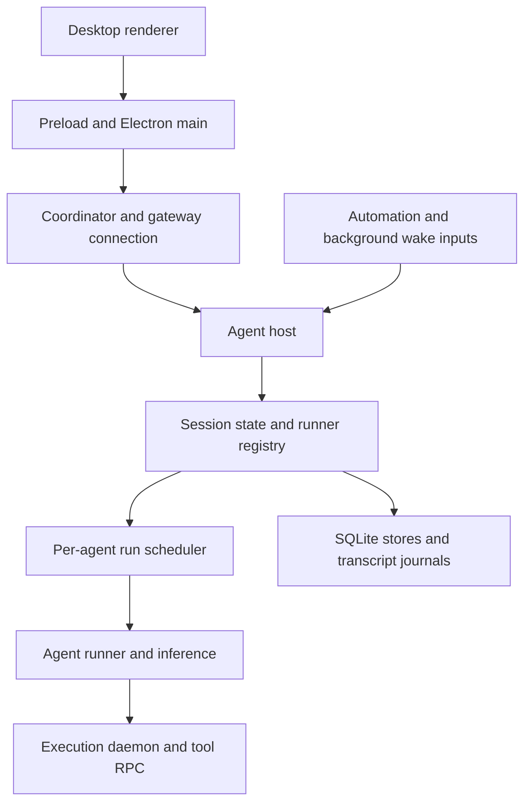

# Grok Bot reference for nimplex

Recorded on 2026-09-15. This is an architecture study, not an implementation
change or a claim about the complete production Grok Bot fleet.

## Source and confidence

The likely project Kevin recalled is
[b-nnett/grok-bot-0.18-reconstructed](https://github.com/b-nnett/grok-bot-0.18-reconstructed).
The identification is provisional because Kevin has not supplied a repository URL.
We inspected revision `a9f633e09d49a85829b8236331b9e21f7e612634`, whose commit
timestamp is 2026-08-23. All source references below pin that revision.

The repository describes itself as an unofficial reconstruction of a shipped
0.18.0 application, with additional provider-routing and local-Docker experiments.
It is not the original upstream monorepo. Its
[provenance](https://github.com/b-nnett/grok-bot-0.18-reconstructed/blob/a9f633e09d49a85829b8236331b9e21f7e612634/PROVENANCE.md)
and [notice](https://github.com/b-nnett/grok-bot-0.18-reconstructed/blob/a9f633e09d49a85829b8236331b9e21f7e612634/NOTICE.md)
do not assert an upstream source-code license. Public availability should not be
described as an official open-source release. This study records mechanisms in
our own words; no reconstructed implementation is added to nimplex.

This is Grok Bot, not the separate Grok Build terminal harness referenced in the
[earlier local-runtime design](2026-09-13-local-runtime.md). Search results for
these names should not be combined into one architecture.

## Observable boundaries

The reconstruction separates the desktop client, connection coordination,
agent hosting, and tool execution. The following is a logical boundary diagram,
not an assertion that every box is a separate production deployment:

The [repository overview](https://github.com/b-nnett/grok-bot-0.18-reconstructed/blob/a9f633e09d49a85829b8236331b9e21f7e612634/README.md)
documents remote-box and experimental local-Docker connection paths.
The [host supervisor](https://github.com/b-nnett/grok-bot-0.18-reconstructed/blob/a9f633e09d49a85829b8236331b9e21f7e612634/source/node-agent-coordinator/gateway/host-supervisor.ts)
handles connection attempts and health-cache invalidation. The
[execution daemon](https://github.com/b-nnett/grok-bot-0.18-reconstructed/blob/a9f633e09d49a85829b8236331b9e21f7e612634/source/box-exec-daemon/server.ts)
exposes control and streaming execution services. Process separation alone does
not establish a security boundary; nimplex must retain its own credential and
sandbox isolation rules.

## Mechanisms worth studying

| Observed mechanism | Direct evidence | Possible use in nimplex |
| --- | --- | --- |
| Runners are created on demand and cached by session ID | [RunnerRegistry.getRunner](https://github.com/b-nnett/grok-bot-0.18-reconstructed/blob/a9f633e09d49a85829b8236331b9e21f7e612634/source/host/extensions/transcript/runner-registry.ts) | Keep active sessions warm without assigning every stored session a permanent process |
| A scheduler maintains user, agent, and background lanes per agent | [SandRunScheduler](https://github.com/b-nnett/grok-bot-0.18-reconstructed/blob/a9f633e09d49a85829b8236331b9e21f7e612634/source/host/extensions/transcript/run-scheduler.ts) | Serialize session mutations and prioritize interactive work; add fairness so background work cannot starve |
| Agent metadata and transcript entries use SQLite; conversation blobs have a separate SQLite store | [Agent DB](https://github.com/b-nnett/grok-bot-0.18-reconstructed/blob/a9f633e09d49a85829b8236331b9e21f7e612634/source/host/extensions/session/agent-db.ts), [schema](https://github.com/b-nnett/grok-bot-0.18-reconstructed/blob/a9f633e09d49a85829b8236331b9e21f7e612634/source/host/extensions/session/agent-db-schema.ts), [blob DB](https://github.com/b-nnett/grok-bot-0.18-reconstructed/blob/a9f633e09d49a85829b8236331b9e21f7e612634/source/host/agent-isolation/conversation-blob-db.ts) | Separate session metadata, execution history, and large artifacts conceptually; storage engine remains an independent choice |
| Transcript mirroring has prepare, commit, and recovery operations | [Transcript mirror](https://github.com/b-nnett/grok-bot-0.18-reconstructed/blob/a9f633e09d49a85829b8236331b9e21f7e612634/source/host/transcript-mirror/transcript-mirror.ts) | Define authoritative checkpoints and derived transcript views explicitly |
| Pending wake markers are written to a file through a temporary-file rename | [Pending wake store](https://github.com/b-nnett/grok-bot-0.18-reconstructed/blob/a9f633e09d49a85829b8236331b9e21f7e612634/source/host/extensions/transcript/sand-pending-wake-store.ts) | Persist future work rather than relying only on timers or in-memory queues |
| Automation delivery polls a backend and reports completion with run identifiers | [Automation fire consumer](https://github.com/b-nnett/grok-bot-0.18-reconstructed/blob/a9f633e09d49a85829b8236331b9e21f7e612634/source/host/extensions/automations/sand-automation-fire-consumer.ts) | Treat schedules and incoming messages as durable, deduplicated wake requests |
| Upgrade handling requests quiescence and records agents needing continuation | [Upgrade resume](https://github.com/b-nnett/grok-bot-0.18-reconstructed/blob/a9f633e09d49a85829b8236331b9e21f7e612634/source/host/extensions/transcript/upgrade-recreate-resume.ts) | Design deployment draining and recovery separately from resource reload |

These are observations of reconstruction code, not measured reliability claims.
We downloaded selected text sources for static inspection; we did not install,
execute, benchmark, or authenticate the reconstructed application.

## Limits and counterexamples

The scheduler's ordinary path admits one active run per agent. Its watchdog can
release a stuck predecessor after a grace period and retain its promise as a
zombie. A generation check protects later scheduler settlement. That does not
demonstrate distributed database fencing or prevent all old external tool effects.
nimplex must not equate this in-memory generation with a cross-host lease epoch.

The agent database write helper can report a dropped write when SQLite is busy.
The [send pipeline](https://github.com/b-nnett/grok-bot-0.18-reconstructed/blob/a9f633e09d49a85829b8236331b9e21f7e612634/source/host/extensions/transcript/send-pipeline.ts)
explicitly includes a path that continues after non-durable acceptance. This is
a reason to preserve nimplex's stronger target: acknowledge accepted work only
after a durable commit. The observation applies to this revision, not a claim
about every version of the official product.

An instruction asking the model not to repeat previous actions during upgrade
recovery is not an idempotency guarantee. Recovery also needs tool-call identity,
durable outcomes, and explicit handling of unknown side effects.

The inspected code does not establish the production fleet's central database,
placement algorithm, replication guarantees, distributed ownership protocol,
tenant density, or capacity. SQLite inside an agent host neither proves that
the whole cloud platform uses SQLite nor proves SQLite unsuitable for a hosted
system with appropriately managed durable storage.

## Implications for nimplex

The useful distinction is between a persistent session and the temporary process
executing it. A session host can itself run inside a worker process. The real
choice is how much work that process owns: an executor step, an entire turn, or a
session activation containing several turns.

Our existing hosted adapter claims `work_items`, renews leases, and increments a
fence on takeover. That is visible in
[worker ownership](../../apps/worker/src/index.ts) and the
[hosted schema](../../packages/db/src/schema.ts). It does not implement the Grok
runner registry or imply one dedicated Pi process per persistent agent.

A nimplex session-host design could retain PostgreSQL as authority, cache Pi
runners on leased hosts, and retain just-bash-first routing with native sandboxes
created when required. This is our candidate design, not a claim that Grok uses
PostgreSQL, Pi, just-bash, or nimplex's fencing scheme.

See [cloud architecture candidates](2026-09-15-cloud-agent-candidates.md) for
the alternatives and the owner's confirmed long-term product direction.
