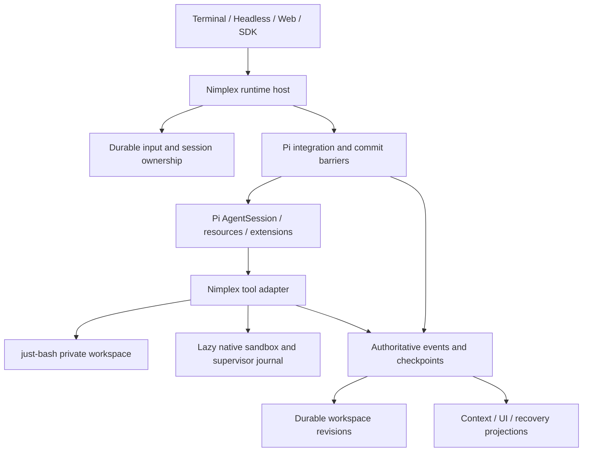

# Durable Pi harness: implementation plan

Prepared on 2026-09-16 at Kevin's request. This is the proposed implementation
sequence for the [mandatory requirement](2026-09-16-pi-durable-runtime-requirement.md).
It authorizes no claim that the proposed capabilities already exist. Cloudflare
adoption remains a separate decision.

## Scope addition: native and browser continuity

Kevin confirmed native snapshots, Chrome/browser sessions and logs as required
recovery scope. The [environment and browser recovery specification](2026-09-16-environment-browser-recovery.md)
extends Phases 1, 3, 4, 5 and 6 and their acceptance gates. Workspace-only
restoration is insufficient for this scope. Full-memory snapshot guarantees remain
provider-dependent and must be tested.

## 1. Outcome and recommended composition

Build durable cloud execution for Pi agents: preserve Pi's session workflows and
extension ecosystem, execute workspace tools through just-bash with lazy native
sandboxes, and recover from committed records after client, process, or environment
failure. Terminal, headless, and future web clients use the same execution authority.

Prefer Pi AgentSession and its public resource/extension machinery for behavior,
with a nimplex durability bridge and runtime host controlling admission, ownership,
commit barriers, accounting, and restoration. This composition is conditional on
Phase 0 proving every required barrier. A subscription that merely mirrors events
is not a valid substitute. Do not rewrite Pi's model/tool loop.

Keep local SQLite and hosted PostgreSQL during migration. Retain the existing
work-item worker topology until the shared integration passes failure tests.
Warm session hosts and Durable Objects are later deployment choices, not
prerequisites for correct persistence.

## 2. Baseline and a concrete integration risk

Existing source already contains:

- `packages/runtime/src/pi-executor.ts`: Pi Agent orchestration, model dispatch intent,
  persisted assistant responses, pending-tool recovery, tool/workspace commits.
- `packages/core/src/executor.ts`: awaited persistence callbacks and a shared
  executor contract used by local and hosted adapters.
- `packages/runtime/src/checkpoints.ts` and `apps/worker/src/checkpoints.ts`:
  SQLite and PostgreSQL commit implementations.
- `packages/runtime/src/bash-routing.ts`, `workspace.ts`, and `native-bash.ts`:
  whole-script routing, snapshots, supervisor journals, environment generations.
- Local CLI and shared runtime, hosted work-item leases/fencing, and fault-test
  infrastructure. These are migration assets, not components to rebuild blindly.

Installed Pi is pinned to 0.85.1. Inspection of its SDK declarations and shipped
JavaScript found that `createAgentSession` accepts a concrete `SessionManager`,
whose append methods return synchronously. Its constructor is private. The
installed `AgentSession._emit` invokes listeners without awaiting returned
promises, whereas the lower-level `Agent` awaits its listeners. AgentSession also
persists several session operations outside ordinary message handling.

Consequently, `session.subscribe(async event => writeToPostgres(event))` is not a
commit barrier in this version. Injecting a session manager does not by itself
establish an asynchronous database storage seam. Audit actual behavior rather
than assuming upstream main or another Pi release matches this installation.

## 3. Authority and record contract

Nimplex's committed records are the recovery authority. Pi's live state and any
Pi-compatible exported session files are projections, not a second writable
truth. Preserve Pi entry identity, parent links, custom entries, labels, branch
summaries, compaction metadata, and model/settings changes losslessly where
applicable; do not reduce Pi sessions to user/assistant message arrays.

Proposed concepts, with names finalized in contracts before implementation:

| Record | Purpose |
| --- | --- |
| Agent | Durable configuration and scheduling identity; may own multiple sessions |
| Session and branch | Conversation/workspace lineage; distinguish Pi tree navigation from a workspace fork |
| Turn/run | Accepted unit of user or scheduled work; explicitly map existing local turn and hosted run IDs |
| Input/inbox item | Stable request ID, ordering, steering/follow-up kind, delivery/consumption state |
| Event envelope | Schema version, session/run/branch identity, sequence, event ID, cause, payload |
| Pi entry mapping | Lossless Pi entry ID and parent mapping with a versioned projector |
| Tool operation | Stable call ID, intent, execution class, provider handle, known/unknown outcome |
| Workspace revision | Base revision, durable files/manifest, metadata and content digest |
| Checkpoint | Projection version, high-water sequence, digest and pinned resource versions |
| Ownership | Local process lock or hosted lease/epoch; validate every authoritative commit |

Sequence allocation, state transitions, and their describing events must commit
atomically. Request IDs deduplicate repeated input submissions. Tool-call identity
is scoped by session/run to avoid collisions. A checkpoint accelerates replay;
an invalid or absent checkpoint must not invalidate intact history.

Keep files in existing database storage initially. If large blobs later move to
object storage, upload and verify immutable content before committing references;
collect unreferenced blobs separately. No DB transaction can atomically commit an
arbitrary external API action. Define retention and replay guarantees explicitly.

## 4. Execution and recovery rules

1. Validate input, assign identity, and durably accept it before acknowledging.
2. Acquire the session's execution authority and restore its committed projection.
3. Commit model dispatch intent before dispatch. Persist the full response, tool intents,
   usage and settlement before tool execution. Unknown requests retain uncertainty.
4. Persist tool intent, execute through the chosen backend, and commit result plus
   workspace revision before the next dependent action.
5. Atomically complete the turn or enqueue its continuation. A disconnected client
   does not cancel accepted work. Explicit cancellation is a durable transition.

| Failure boundary | Required recovery |
| --- | --- |
| Accepted input before dispatch | Deliver the same inbox item once logically; do not create a new user turn |
| Model request without committed response | Record unknown outcome/charges; any retry is a new identified attempt under policy |
| Committed assistant response before tools | Reuse the response and dispatch only pending tools |
| Uncommitted private VFS mutation | Discard private state; replay only operations classified as replay-safe |
| Native tool dispatched, executor dies | Reattach to the same provider handle and tool journal; collect rather than redispatch |
| Native environment lost with pending tool | Restore last committed workspace, increment generation, expose unknown effects |
| Tool/workspace committed, turn unfinished | Skip completed operations and finish continuation/terminal transition |
| Lease lost or cancellation committed | Reject late state changes; reconcile external effects without reviving the turn |

Default unknown external actions to a visible paused/reconciliation state. Allow
safe continuation only under an explicit operation policy. Recovery restores
agent records and durable files, not arbitrary process memory, sockets, or every
installed dependency. A sandbox snapshot may improve continuity but is not the
only authority for task state.

## 5. Tool adapter and extension contract

Extract existing tools into one shared module, then expose a thin Pi extension
factory over it. Both local and hosted execution use this module; avoid a second
implementation for the extension.

- Route the complete shell script before execution. Never retry an already
  partially executed script wholesale in another environment.
- Make read/write/edit/bash and supported grep/find/ls/user-shell operations see
  the same workspace. Native fallback never silently executes on the trusted host.
- Native execution starts lazily, synchronizes the committed base revision,
  journals tool identity, and commits validated results back to durable storage.
- Serialize mutations initially. Preserve Pi's parallel execution capability via
  an explicit later policy for independent operations; record any temporary parity
  gap. Concurrent workspace writes require conflict detection or serialization.
- Classify tools as private-workspace replay-safe, externally idempotent with a
  stable key, reconcilable by provider handle, or externally uncertain.
- Full Pi extension compatibility remains a target. Arbitrary trusted extension
  code can perform IO outside registered tools; it cannot automatically inherit
  recovery or isolation guarantees. Inventory those effects and provide durable
  operation helpers. Keep explicit unsupported guarantees visible, not hidden.
- Separate the extension trust environment from untrusted tool sandboxes. Existing
  provider-secret boundaries must not weaken merely to load an extension.

## 6. Delivery phases and gates

### Phase 0: prove Pi composition before migration

Own: isolated fixtures under `sandbox/`, version audit, and a checked-in design/test
report. Do not change the production default.

Test a real AgentSession with a representative extension, custom tool, compaction,
branch operation, and resource reload. Inventory all mutation paths, including
extension custom entries, automatic retries, steering and user shell commands.
For each, identify an awaited pre-effect and post-result barrier and the restore
path. Inject delayed/rejected persistence and kill the process around boundaries.

**Gate:** model response commits before tools; tool/workspace commits before the
next model call; required write failures halt dependent execution; restoration
preserves Pi entry identity and extension state. A command/event inventory must
show no unaudited authoritative mutation path.

If public APIs fail this gate, retain the current executor. Prepare a minimal
upstream async-storage/lifecycle proposal or evaluate a pinned release that solves
the observed gaps. A maintained fork is a last-resort separate decision; no private
method monkey-patching in the production adapter. Do not relabel event mirroring
as durability to pass the gate.

### Phase 1: define and implement durable session contracts

Own: `packages/contracts`, pure reducers/ports in `packages/core`, local store,
`packages/db` migrations, and persistence adapters.

Add versioned envelopes, inbox identity, Pi entry mappings and resource versions
as needed after the audit. Reuse existing model/tool records and workspace commits.
Run the same conformance fixtures against SQLite and PostgreSQL. Provide read
adapters for old records rather than destructive history rewrites.

**Gate:** duplicate submissions do not duplicate turns; replay and checkpoint
restore agree; existing records remain readable; commit failures preserve atomicity.

### Phase 2: integrate AgentSession and complete Pi behavior

Own: `packages/runtime` Pi bridge, resource loading and projection; CLI adapters.

Introduce a per-session engine version so new test sessions use the bridge while
existing sessions keep their original engine. Do not run two executors against
the same authoritative session. Connect Pi model/auth/settings/resources through
public APIs and make nimplex persist all required lifecycle changes.

Track every row of the [Pi inventory](2026-09-15-pi-compatibility.md): providers,
thinking, tools, prompts, skills, context files, extensions, packages, steering,
follow-ups, multimodal input, compaction, branches, themes/keybindings, JSON/RPC,
exports, diagnostics, trust, reload and upgrades. A name-compatible slash command
is not sufficient evidence of compatibility.

**Gate:** paired baseline-Pi/nimplex behavioral fixtures pass for each claimed
capability, alongside the Phase 0 failure suite. Unfinished rows remain explicit
release blockers for a full-parity claim.

### Phase 3: expose tiered tools through the Pi extension

Own: runtime tools/workspace/native modules, `packages/sandbox`, extension factory.

Reuse AST routing, workspace encoding and provider journals. Complete remaining
Pi tool and user-shell adapters. Persist sandbox references/generation and verify
pause/resume, reset and cancellation under the new session bridge.

**Gate:** a scripted task edits in just-bash, installs/builds in a native sandbox,
then reads the result through the same workspace. Killing the executor must not
repeat a journaled native action. Environment loss reports unknown effects.

Phase 3 now includes 3a (native snapshot contracts and capture) and 3b (browser
profiles, action journals and restoration), defined in the
[environment recovery specification](2026-09-16-environment-browser-recovery.md).
Its Chrome crash, sandbox loss, interrupted browser action and manifest failure
cases are additional exit gates.

### Phase 4: durable session controls and reload

Own: runtime inbox/recovery/resources and terminal/headless controllers.

Persist steering and follow-up input by ID, then record consumption at the Pi
boundary. Model changes, tree navigation, compaction and branch operations need
versioned commits. Define whether each branch operation preserves or forks files;
restoring conversation history alone must not imply file rollback.

Resource reload validates a candidate version, applies at a safe idle boundary,
and records the new resource digest. Failed reload keeps the prior version.
Retain recoverable resource versions or fail visibly if unavailable. Separate
resource reload from executable deployment: drain, checkpoint, restart, restore.

**Gate:** queued inputs, session tree and compaction survive restart; no mixed
resource version within a tool operation; clients reconnect from durable cursors.
UI streaming may be provisional, but only committed events advance replay cursors.

### Phase 5: expose the same session runtime in the cloud

Own: public contracts, `apps/api`, `apps/worker`, `packages/sdk`, cloud session DB.

Add authenticated organization-scoped session/input/event APIs. Map existing runs
to sessions explicitly; keep existing API clients working. Start with the present
worker claim mechanism. If active sessions remain warm, runners are caches and
must unload on ownership loss; define session versus work-item lock ordering.

Provide remote terminal attach, replay after disconnect, durable schedules/wakes,
deduplication and tenant admission. Local/cloud transfer is an explicit frozen
checkpoint export/import with a new ownership boundary, not bidirectional live
sync or automatic credential copying.

**Gate:** two hosts, forced takeover, reconnect and cancellation pass the same
fixtures. An expired host cannot commit or destroy the successor's sandbox.
Verify tenant isolation and queued-work fairness before scale claims.

### Phase 6: qualify the release and evaluate deployment alternatives

Own: acceptance harness, operational documentation, backup/restore and compatibility
matrix. Each preceding phase includes its own failure tests; this is integration
qualification, not deferred testing.

Run local and hosted suites, native-provider tests and controlled real-model smoke
checks. Exercise backup/restore, schema/engine upgrades, version mismatch, artifact
loss and interrupted migration. Record latency, DB operations, active/idle memory,
recovery time, storage growth and per-tenant fairness at declared workload sizes.

Only then compare warm activation hosts or a Cloudflare adapter against the same
contracts. Storage and ownership primitives may differ; externally visible session
semantics must remain explicit. No platform migration is required to complete the
initial durable Pi harness.

## 7. Migration and module discipline

Start inside existing packages; proposed modules such as `pi-session-bridge`,
`session-projector`, `durable-inbox`, `recovery`, and `tool-adapter` describe
responsibilities, not a mandate to create all files immediately. Public contracts
come first, pure reducers remain IO-free, and SDK clients depend on contracts.

Use additive schema changes, engine/projector version tags, backups and explicit
per-session cutover. A failed cutover keeps the original session authoritative.
After a new engine has committed new state, rollback requires a compatible reader
or explicit export; a feature flag alone is not a safe data rollback.

Avoid dual authoritative writes to Pi JSONL and nimplex's database. Export JSONL
as a compatibility artifact if needed. Preserve raw history through compaction
and migrate workspace revisions with their content, not merely transcript text.

## 8. First concrete deliverable and completion definition

The next implementation task is Phase 0, followed by a small vertical slice:
AgentSession plus one extension, one durable input, one workspace tool, process
kill, and restoration with no lost committed work. Its result chooses the bridge
mechanism before broad parity or cloud changes begin.

Completion requires both the full versioned Pi compatibility inventory and the
recovery/failure matrix to pass, plus the tiered native workflow and hosted
ownership scenario. An arbitrary trusted extension's opaque external IO remains
outside automatic replay guarantees unless explicitly integrated. Explain that
boundary in the public capability contract.

Initial planning validation was source/declaration inspection only. Implementation
has now started with the [pinned composition qualification](2026-09-16-pi-composition-gate.md):
real AgentSession/extension and SIGKILL fixtures reproduce missing commit barriers.
The AgentSession observer composition failed; the existing executor remains the
default. A subsequent audit found the same pinned version's public AgentHarness
and async Storage port. An experimental SQLite adapter passes upstream storage
conformance and positive response/tool commit and SIGKILL recovery fixtures.
Full mutation-path and extension parity qualification remains open. The
[async storage proposal](2026-09-16-pi-async-storage-proposal.md) is now a fallback
for AgentSession-specific gaps, not evidence that a fork is required. Neither
negative fixtures nor these initial positive results complete this plan.

The first independent Phase 1 slice adds local versioned input acceptance,
session-scoped request-ID deduplication, atomic SQLite schema migration and
headless `--request-id` support. See
[the implemented acceptance contract](2026-09-13-local-runtime.md#durable-input-acceptance-added-2026-09-16).
It does not complete the hosted inbox, Pi entry store, steering/follow-up delivery,
browser/snapshot recovery, parity matrix or the remaining release gates.

On 2026-09-17 the first Phase 2 slice landed: a per-session engine version and an
opt-in production engine on the public AgentHarness with atomic SQLite commits,
enforced reservation/settlement, tool/workspace commits, durable cancellation and
real SIGKILL recovery. See the
[composition report](2026-09-16-pi-composition-gate.md#production-engine-slice-added-2026-09-17)
and the [runtime contract](2026-09-13-local-runtime.md#pi-harness-engine-opt-in-added-2026-09-17).
The default engine is unchanged; adopting the harness as the bridge remains a
recommendation awaiting Kevin's confirmation. The same day added budgeted
summaries, context modes, Codex dispatch, Pi-policy branching, durable
steering/follow-up input, and a PostgreSQL Storage adapter passing the shared
conformance suite (Phase 1 gate for both stores). Phase 3 native/browser work,
Phase 4 resource reload, Phase 5 hosted harness execution/takeover and Phase 6
release qualification remain open.

## Status on 2026-09-18

Implemented and verified since the 2026-09-17 opt-in engine:

- Phase 5 (cloud): hosted harness runs on PostgreSQL through the engine's host port,
  one leased `harness` work item, fenced commits, SIGKILL/SIGSTOP takeover, continuation
  lineage, and `start_at` scheduled runs. Remote attach is the existing resumable SSE.
- Phase 2/4 (behavior): per-turn thinking levels and per-turn model switching synced
  into Pi's lane configuration; OpenAI API models via Pi's Responses adapter with
  priced settlement and provider output floors; `/thinking`, `--thinking`,
  `nimplex login openai`.
- Phase 3 (extensions): trust-gated Pi extension bridge for local harness sessions
  (`pi-extensions/bridge.ts`), `/trust`, `/extensions`, fail-closed load errors.
- Evidence: `pnpm bench` and `2026-09-18-harness-benchmark.md`.

Still open: web client, subagents/agent graphs, an agent-facing schedule tool,
extension commands/UI/`setModel`, transcript projection for extensions, hosted
extension execution, native/browser snapshots, default-engine cutover.

## Scope revision on 2026-09-20

Kevin removed USD budget enforcement and selected Pi's native providers as the
model/auth foundation. Preserve call identity, usage accounting and all durable
commit/ownership/recovery requirements. Historical reservation/budget milestones
above describe the earlier implementation, not current admission policy. See the
[updated runtime contract](2026-09-13-local-runtime.md#budget-removal-and-pi-providers-2026-09-20).

## Default-engine cutover on 2026-09-25

Kevin confirmed the harness as the bridge and made it the default for new sessions;
see the [runtime contract](2026-09-13-local-runtime.md#harness-engine-becomes-the-default-2026-09-25).
Existing sessions are not migrated. The local Phase 6 release-qualification items
(real-model smoke, backup/restore, schema/engine upgrades, version mismatch,
interrupted migration) were run end to end before the switch; results, the defect
they found and the remaining gaps are in
[release qualification 2026-09-25](2026-09-25-release-qualification.md). Hosted
suites and per-tenant fairness no longer apply to the local-only scope.
